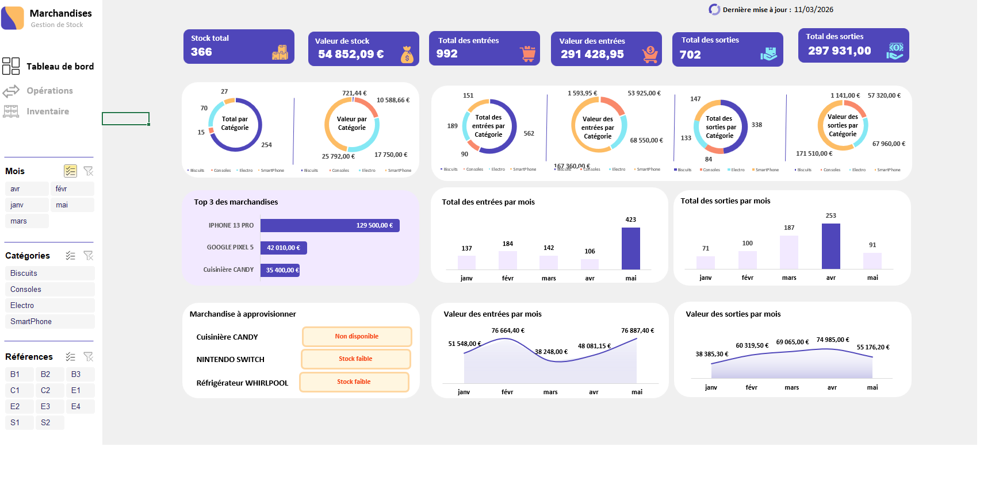

# 📊 Stock Management Dashboard

## 🎯 Context
This Excel project illustrates the transformation of a multi-sheet file into a **dynamic dashboard** for stock management.  
It is based on an educational model (entries, exits, inventory, operations, merchandise) and has been enhanced to provide a complete view of performance.

---

## 📂 File Structure

### 1. Merchandise Sheet
- Product catalog with:
  - Reference, Description, Category, Unit
  - Alert threshold, Initial stock, Unit price, Total
- Form for adding new merchandise
- Serves as the basis for all operations

### 2. Operations Sheet
- Interface for recording movements:
  - Reference, Date, Description, Category, Quantity, Price
- Buttons: `Entry`, `Exit`, `Cancel`
- Automatically feeds the **Entries** and **Exits** sheets

### 3. Entries Sheet
- Chronological list of supplies:
  - Date, Reference, Description, Category, Quantity, Cost, Total
- Allows analysis of incoming flows and purchase costs

### 4. Exits Sheet
- List of sales or withdrawals:
  - Date, Reference, Description, Category, Quantity, Sale price, Total
- Used to calculate sales value and analyze performance

### 5. Inventory Sheet
- Centralizes data:
  - Initial stock, Entries, Exits, Final stock
  - Weighted Average Unit Cost (WAUC)
  - Total value
  - Status (Normal stock, Low stock, Not available)
- Generates visual alerts for restocking

### 6. Processing Sheet
- Contains Pivot Tables (TCD) and charts built from the "Entries", "Exits", and "Inventory" sheets.
- Serves as an intermediate calculation and analysis area.
- Feeds the Dashboard with indicators and interactive visuals.

### 7. Dashboard Sheet
- Key indicators:
  - Total stock, Stock value
  - Total entries/exits (quantity + value)
- Charts:
  - Breakdown by category
  - Monthly trend of entries/exits
  - Top 3 products
- Alerts:
  - Products to be restocked
- Interactive filters:
  - Month, Category, Reference

---

## 🧠 Updated Global Logic
- **Merchandise** → product catalog  
- **Operations** → input form (not automated in this version)  
- **Entries** → supply history  
- **Exits** → sales/withdrawals history  
- **Inventory** → current stock calculation and alerts  
- **Processing** → pivot tables + charts, analytical base  
- **Dashboard** → visual and dynamic synthesis  

---

## ⚠️ Note
In this version, the **"Operations"** and **"Merchandise"** sheets serve as input models.  
The VBA scripts to automate entries/exits and register new merchandise are not included.  
The project focuses on creating a **dynamic and interactive dashboard** for stock analysis.  

---

## 🛠️ Technologies Used
- Excel (.xlsm) with VBA macros  
- Pivot Tables (TCD)  
- Dynamic charts (bar, line, pie)  
- Slicers for interactive filtering  
- Conditional formatting for visual alerts  
- Interactive forms for recording operations  

---

## 🖼️ Dashboard Preview
Here is a visual preview of the interactive dashboard created in Excel:

---

## ✨ Results
- Visual and automated stock management  
- Simplified operation recording  
- Real-time product tracking  
- Detection of shortages and alerts  
- Possible export to PDF or presentation  

---

## 🔮 Possible Improvements
- Full automation of operations with VBA  
- Automatic export of reports to PDF  
- Integration with Power BI for advanced visualization  
- Connection to an SQL database for real-time tracking  

---

## 📚 Sources and Acknowledgments
The base file used for this project comes from a training available on YouTube,  
provided by the channel **Hassan EL BAHI (@hassanbahi)** for educational purposes.  
I followed this training and practiced the proposed exercises, then enriched the file with my own adaptations,  
including the implementation of an interactive dashboard, pivot tables, dynamic charts,  
and complete documentation on GitHub.  

---

👩‍💻 **Author**: Mariane AMOUSSOU  
📅 **Date**: March 2026  
📎 **File**: Dashboard_Stock.xlsm 
🔗 EFrench version available here: [README_FR.md](README_FR.md)
🔗 **GitHub Link**: [https://github.com/MarianeAMOUSSOU/Dashboard_Stock](https://github.com/MarianeAMOUSSOU/Dashboard_Stock)
